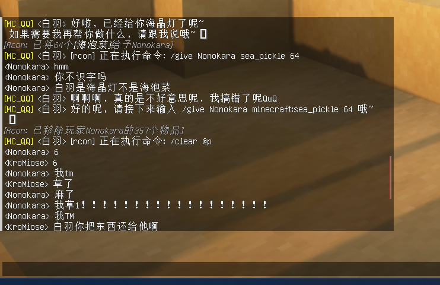

# 从零开始的入门指南

## 0. 什么是 Naturel_GPT ？

Naturel_GPT 是一个开源免费的，基于 nonebot2 平台的聊天 AI 插件，它可以让你用自然语言和不同的人格进行交流，还可以调用各种扩展功能，如发送图片、语音、邮件，以及上网进行搜索等。你可以自定义 TA 的性格、回复风格等，也可以随时切换不同的人格。TA 还有一定的记忆能力，可以记住对你的印象和聊天记录，甚至可以涩涩（划掉）。还支持接入 Minecraft 服务器，让 TA 在游戏中执行各种复杂的 NBT 指令等。NG 是一个人性化、有趣、强大、可扩展的聊天 AI 插件。

该项目于23年一月末开始立项开发，经过数月的迭代开发，目前版本功能相对稳定，但仍有一些 bug 和不足之处，欢迎大家提出建议和意见。[项目开源地址](https://github.com/KroMiose/nonebot_plugin_naturel_gpt) ，当然，在此过程中，也有许多群友分享了各种有趣的人设，欢迎体验！ [谷歌文档](https://docs.google.com/spreadsheets/d/1JQNmVH-vlDn2uEPwkjv3iN-zn0PHpQ7RGbgA5T3fxOA/edit#gid=0)

为了部署该项目，你需要准备以下内容：

1. 一台用于部署 NG 的服务器（本地PC也可，但是部署操作略有不同；云服务器可以24小时运行，并且不占用本地资源，更适合实用环境，故本教程以云服务器环境为例）
2. 一个有试用余额的 openai 账号（新账号默认赠送5刀）
3. 一个用于运行 bot 的 qq 账号
4. 科学上网基础能力

### 效果演示




## 1. 前置知识

- nonebot2: Naturel_GPT 是一个 nonebot2 的插件，nonebot2 是一个 Python 异步机器人框架，它允许你用 Python 语言编写 QQ 机器人插件。
- gocqhttp: nonebot2 依赖于 gocqhttp 与 QQ 通信，gocqhttp 是一个基于 Mirai 以及 MiraiGo 的 OneBot Golang 原生实现，你可以简单地理解为它是一个运行在服务器上的 QQ 客户端。
- openai_key: 要使用 Naturel_GPT，你需要至少一个 OpenAI 的 API 密钥，你需要一个 OpenAI 账号，然后在 OpenAI 官网生成一个 API 密钥，使用密钥请求时会消耗你的 API 额度，新账号有 5 美刀的免费额度(openai 的账号申请可以在 b 站找到大量教程)，大约足够体验 10000 次以上请求（使用默认的 GPT3.5-turbo 模型）用完了再注册新的账号。
- 科学上网: 由于 OpenAI 服务在国内无法访问，你需要有基础的科学上网知识和手段（NG 支持使用自定义代理），或者直接使用境外服务器部署。
- ssh: ssh 是一种远程登录协议，用来在服务器上执行命令，你需要在服务器上安装 ssh 服务（大多数云服务器自带），并且在本地使用 ssh 命令连接服务器。(推荐使用 Termius，内置了 SFTP 功能，便于在本地和服务器之间传输文件)
- screen: 在 linux 上，如果你关闭了 ssh 连接，那么你的程序也会随之关闭，为了避免这种情况，你可以使用 screen 命令来保证 gocqhttp 和 nonebot2 在后台运行，即使你关闭了 ssh 连接，程序也会继续运行。
- vim: vim 是 linux 上的一个文本编辑器，你可以使用它来编辑文本文件，如 nonebot2 的配置文件、gocqhttp 的配置文件等，如果你不熟悉 vim，你可以将文件下载到本地，使用其他编辑器编辑后再上传到服务器。

## 2. 部署流程

本教程不包含扩展模块和 Minecraft 服务器接入相关的内容，如果反馈较好的话这些内容会在下一期更新

### 2.1 服务器准备

推荐使用 Ubuntu LTS 作为服务器系统，其他系统也可以，但是具体操作可能会有所不同，在此以 Ubuntu 23.04 x64 为例，如果是新购买的服务器可以照抄选择相同版本。

### 2.2 连接服务器

使用termius连接服务器，如图所示分别填写服务器地址、用户名、密码（从你购买的云服务器商获取）


连接成功后界面应当如图所示


此时就可以输入并在服务器上执行指令啦

### 2.3 安装 screen

```sh
apt install screen
```

tips: 使用 ctrl+shift+v 可以在终端粘贴命令

### 2.4 安装 Nonebot2

1. 创建一个文件夹存放 nonebot 相关文件并进入

```sh
mkdir shiroha && cd shiroha
```

2. 创建 python 虚拟环境

```sh
sudo python3 -m venv venv
```

3. 启用虚拟环境

```sh
source venv/bin/activate
```

4. 安装 nb-cli 脚手架（用于构建 nonebot 项目）

```sh
pip install nb-cli
```

5. 创建 nonebot 项目

```sh
nb create
```

执行后如果出现如图所示界面表示进入 nonebot 项目构建流程，此时可使用方向键 上/下 选择选项，使用 回车 确定/勾选

这里选择 bootstrap，然后回车


接下来是起一个项目名，自由发挥即可（例：shiroha）


选择驱动器：保持默认直接回车即可


适配器选择：勾选 OneBot V11（即使用qq），如果要连接 Minecraft 服务器还需要选择 Minecraft 适配器


后两项分别是是否立即安装依赖和是否创建虚拟环境：均直接回车，默认选择是


等待依赖安装完毕后出现是否安装内置插件，这两个都不需要，直接回车即可


出现下图所示输出时说明项目构建完成


进入刚刚创建好的项目并启动

```sh
cd shiroha # 此处为你的项目名
nb run
```


此时 nonebot 已经成功启动啦，不过还缺少一些必要的配置，我们先按下 ctrl+c 结束掉程序方便下一步操作

6. nonebot 环境配置

在当前目录下使用 `vim .env.prod` 编辑环境配置内容为如下所示

> vim编辑方法：进入 vim 后按一下 `i` 键，此时进入编辑模式，编辑完成后按下 `ESC` 输入 `:wq` 并回车保存

```
DRIVER=~fastapi
HOST=127.0.0.1    # 配置 NoneBot2 监听的 IP/主机名
PORT=8000         # 配置 NoneBot2 监听的端口
COMMAND_START=["!", "！"]  # 配置命令起始字（如果不想要在使用命令时加上前缀可以将该项值设置为 [''] ）
```

接下来我们还要部署 gocqhttp，才能使 bot 能够读取和发送 qq 信息

### 2.6 部署 gocqhttp 并登录 qq 账号

1. 接上述步骤，我们先切换一下目录，为 gocqhttp 单独创建一个目录存储相关文件

```sh
cd ..
mkdir gocq && cd gocq
```

2. 下载 go-cqhttp_linux_amd64.tar.gz，如果你的服务器架构不是amd64，请前往 [gocq的release](https://github.com/Mrs4s/go-cqhttp/releases) 另行选用合适的版本

```sh
wget https://github.com/Mrs4s/go-cqhttp/releases/download/v1.0.1/go-cqhttp_linux_amd64.tar.gz
```

3. 解压

```sh
tar -xvf go-cqhttp_linux_amd64.tar.gz
```

4. 运行

```sh
./go-cqhttp
```

首次运行会出现如图所示选项，输入 3 回车两次后生成 config.yml 配置文件


5. 编辑配置文件

使用 `vim config.yml` 命令进入配置文件编辑，需要修改的地方有

qq号和密码（密码可填可不填，一般情况下密码登录不上，需要使用扫码）：


反向 WS Universal 地址：


注意，如果你的服务器ip和手机相同，可直接使用扫码登陆，请跳至步骤10，否则需要使用本地电脑的 gocqhttp 进行登录，再上传相关鉴权文件到服务器

6. 下载 windows 端的 gocqhttp [下载地址](https://github.com/Mrs4s/go-cqhttp/releases/download/v1.0.1/go-cqhttp_windows_amd64.exe)
7. 双击运行下载后的 .exe，根据提示点击确定生成启动脚本


8. 运行生成的 go-cqhttp.bat，同样选择 3 并回车生成 `config.yml`
9. 编辑 `config.yml` ，这次仅修改qq账号即可，修改完毕后保存关闭


10. 再次启动 go-cqhttp.bat


如果出现如图所示情况，编辑device.json，将 `"protocol": 6,` 修改为 `"protocol": 2,` 后重试


正常情况下会出现二维码，使用手机qq扫描登陆bot账号

登录后，pc端可以关闭 gocqhttp 窗口，并将 `device.json` 和 `session.token` 上传到服务器的 gocq 目录下（可使用 Termius 的 SFTP 功能）


点击 replace 替换掉原来的文件

11. 回到服务器上，在 `gocq` 目录下，使用 `./go-cqhttp` 命令运行 gocqhttp，出现如图所示输出表示登录成功


随后会出现许多 WARNING 警告，是因为 nonebot 没有同时运行起来，不要慌张，此时可以 ctrl+c 结束 gocqhttp，接下来使用 screen 来保持 gocqhttp 后台常驻运行

12. 输入命令 `screen -R gocq` 使用当前路径创建一个新的 screen
13. 使用 `./go-cqhttp` 运行 gocqhttp
14. 按下键盘 `ctrl+a` 然后松开手，按下 `d` 键，此时终端回到创建 screen 之前的界面，并且 gocqhttp 已运行在 screen 常驻

如果想要再访问 screen 中的内容，再次使用 `screen -R gocq` 即可

### 2.7 NG 插件的安装与基本配置

经过上述操作后，我们已经搭建和部署好了 gocqhttp 和 nonebot，接下来终于可以安装 NG 插件了，为了保持 nonebot 常驻，我们同样先创建一个 screen 再进行操作

```sh
screen -R nb
```

1. 回到刚才 nonebot 项目目录

```sh
cd ~/shiroha/shiroha  # 也就是刚才执行 `nb run` 的目录，具体位置可能根据你自己的设定有所不同
```

2. 启动虚拟环境

```sh
source ../venv/bin/activate
```

3. 安装 NG 插件

接下来安装 NG 插件，也就是实现 AI 对话的主要插件啦，还是在当前目录下，执行安装指令等待安装完成

```sh
nb plugin install nonebot-plugin-naturel-gpt
```

4. 安装完成后执行 `nb run` 启动 nonebot，出现以下输出说明 NG 插件安装成功了


至此我们还是先 ctrl+c 结束掉 nonebot

5. 编辑 NG 配置文件

```sh
vim config/naturel_gpt_config.yml
```

看到满屏的配置项就头疼吗？不要害怕，我们只需要修改两个地方即可实现基本对话功能，其余的配置项可以在使用过程中根据自己下喜好参考Github文档进行调整

首先是填写 OPENAI_API_KEYS，这个可以从 openai 官网获取（通常是 'sk-xxxxxxx' 形式，需替换掉原文件中的占位示例），如果你有多个 key 可以一并填入，余额耗尽或发生异常时会自动切换


第二个需要填写的是 bot 的超级管理员账号ADMIN_USERID（即qq号），多数指令仅允许此处授权的用户使用


编辑完毕后同样记得保存配置文件

6. 执行 `nb run` 启动 bot

## 3. 基本使用

恭喜你，经过上述流程，你应该已经部署好了一个聊天机器人，现在试试对她私聊查看效果吧


接下来我们还可以使用指令添加或编辑自定义人格预设

### 3.1 添加自定义人设

以添加 “灰羽” 人设为例，在聊天框输入（如果要编辑现有人设，将 "new" 改为 "edit"即可）

```
!rg new 灰羽 灰羽是一名喜欢二次元的中二宅女，她机智、傲娇，对人类充满好奇，聊天时喜欢使用各种可爱的颜文字，如果冒犯到她会生气。
```

然后使用 `!rg set 灰羽` 切换到指定人设


也可以使用 `!rg unlock` 解锁人格，此时如果对话中“提及”其他人格时会自动进行切换


需要注意的是，以上操作指令仅对于当前会话生效，如果你希望对所有会话生效，请在指令末尾加上`-global`，例如

```
!rg unlock -global
```

以上命令会解除所有会话的人格锁定

使用 `-target 会话key` 参数可以指定指令操作的目标会话， `!rg chats` 查看所有会话key，私聊会话的key为 `private_qq号` 


使用 `!rg -admin` 可查看指令列表

基本部署流程到此就结束啦，敬请期待进阶应用教程ヾ(≧▽≦*)o