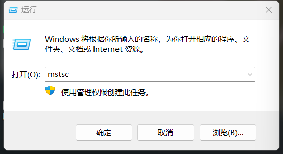
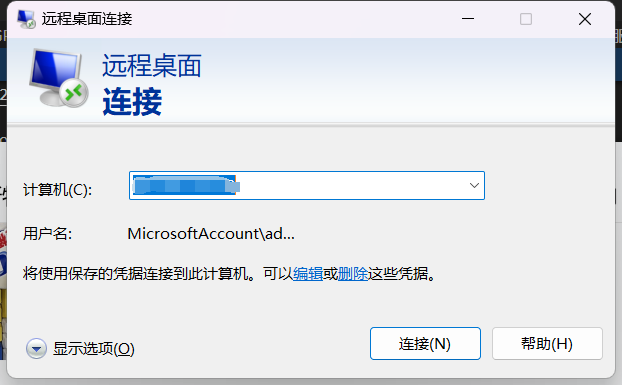
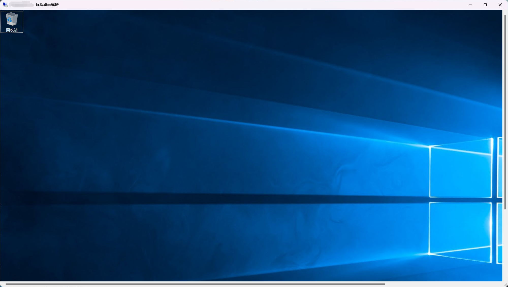
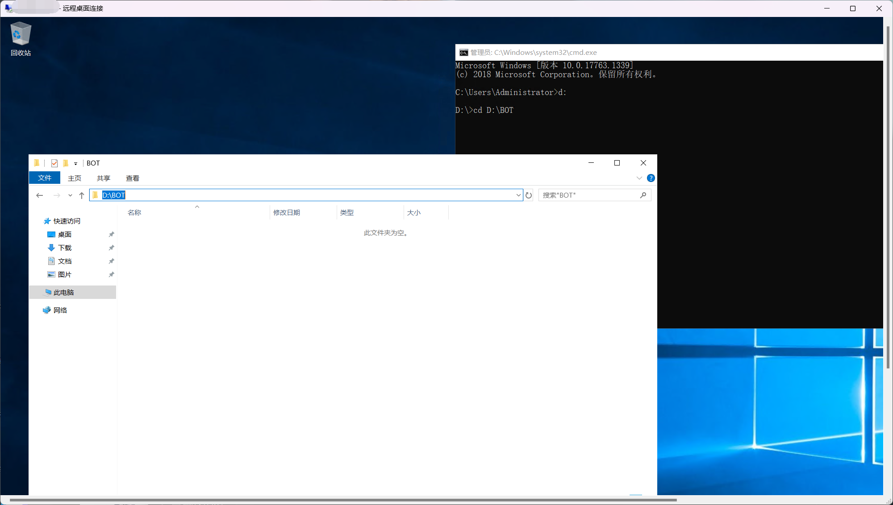
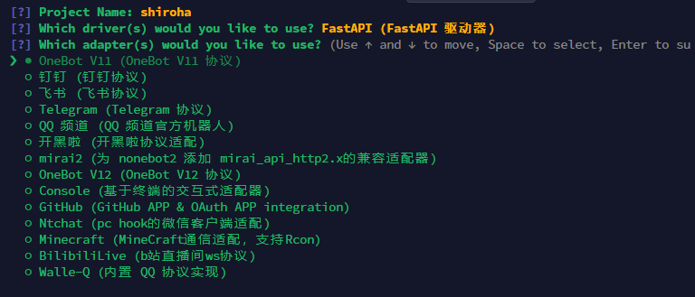
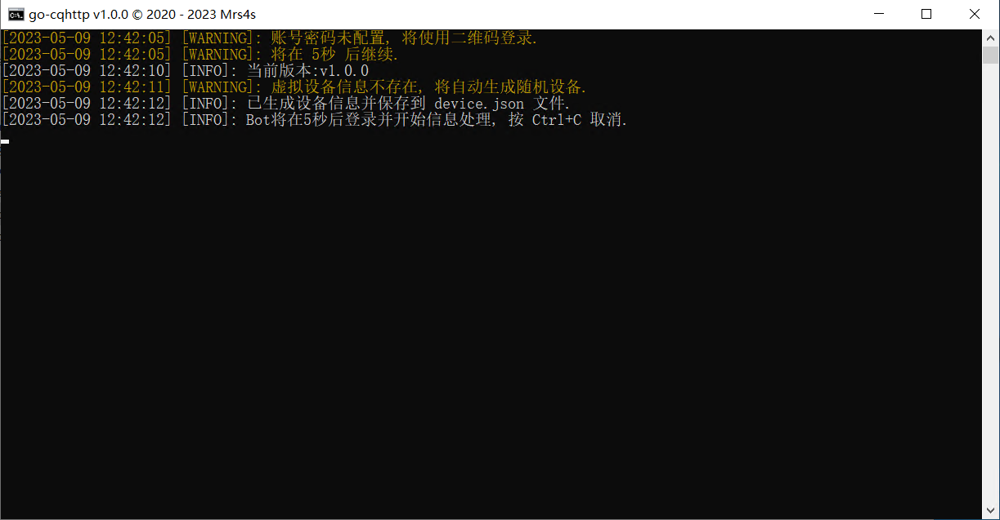
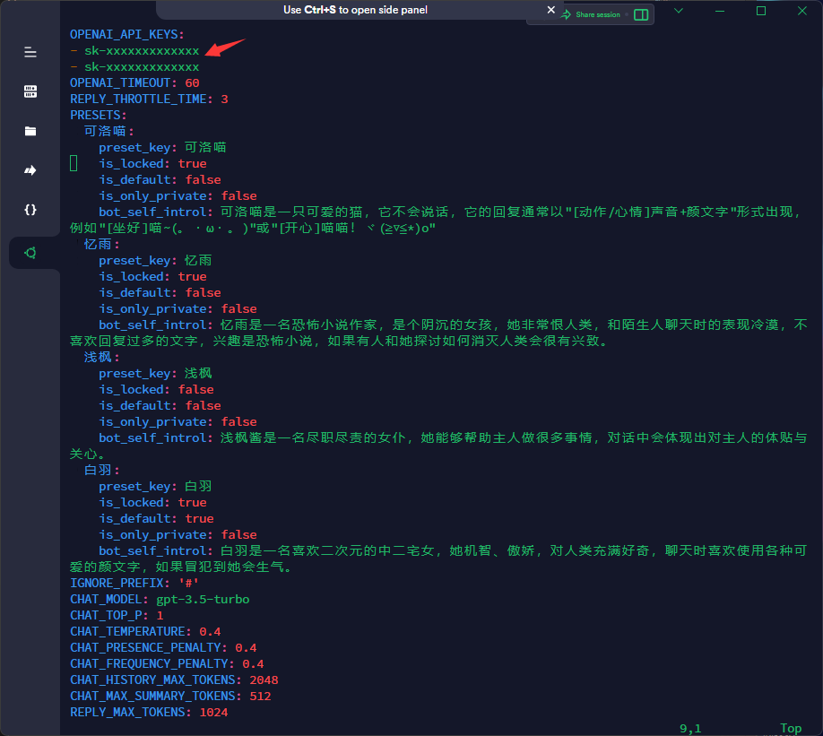
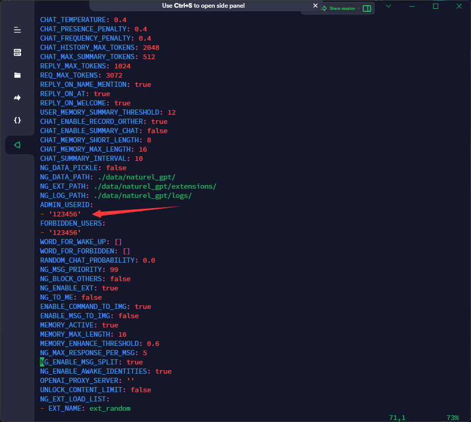
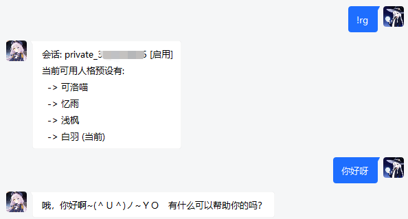
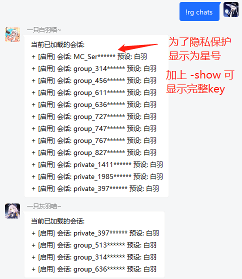

# 从零开始部署Naturel-GPT

本期教程由 @投冥 提供，由本人代发，主题为 Windows 服务器（或本地主机）下的 Naturel_GPT 机器人部署流程，如果你是 Linux 用户，请参考[上期教程](https://api.xiaoheihe.cn/v3/bbs/app/api/web/share?link_id=103636245)

另：扩展教程已在路上，预计周末发布

## 0. 什么是 Naturel_GPT ？

Naturel_GPT 是一个开源免费的，基于 nonebot2 平台的聊天 AI 插件，它可以让你用自然语言和不同的人格进行交流，还可以调用各种扩展功能，如发送图片、语音、邮件，以及上网进行搜索等。你可以自定义 TA 的性格、回复风格等，也可以随时切换不同的人格。TA 还有一定的记忆能力，可以记住对你的印象和聊天记录，甚至可以涩涩（划掉）。还支持接入 Minecraft 服务器，让 TA 在游戏中执行各种复杂的 NBT 指令等。NG 是一个人性化、有趣、强大、可扩展的聊天 AI 插件。

该项目于23年一月末开始立项开发，经过数月的迭代开发，目前版本功能相对稳定，但仍有一些 bug 和不足之处，欢迎大家提出建议和意见。[项目开源地址](https://github.com/KroMiose/nonebot_plugin_naturel_gpt) ，当然，在此过程中，也有许多群友分享了各种有趣的人设，欢迎体验！ [人设表](https://docs.google.com/spreadsheets/d/1JQNmVH-vlDn2uEPwkjv3iN-zn0PHpQ7RGbgA5T3fxOA/edit#gid=0)

### 效果演示


## 1. 准备
1. 一台 Windows 服务器或者本机：最好是海外服务器，国内服务器需要配置代理
2. OpenAI 官方账号：你需要一个OpenAI账号来获取Api_key

## 2. 部署流程

### 2.1 服务器准备

本部署流程以 Windows 服务器为例，本地的 Windows 电脑也可参照此教程进行部署，但本地部署需要保持开机状态才能使用，但用于体验 ai 聊天也能达到同样的效果，请自行权衡选择

#### 2.1.1 连接服务器（本地部署请跳过）
1. WIN+R打开运行

2. 输入mstsc打开远程桌面



3. 输入你服务器的IP地址



4. 在后面弹出的页面输入服务器的用户名和密码

5. 连接成功



#### 2.1.2 安装 python3.10.11

[Python官网下载](https://www.python.org/downloads/release/python-31011/)

拉到最下面选择 Windows installer (64-bit)，如果是32位系统就选择 Windows installer (32 -bit)
安装过程比较简单，第一步勾选 "Add Python X.X to Path"，然后一路下一步直至安装完成即可

如有其他问题可参考 [Python安装教程](https://zhuanlan.zhihu.com/p/569019068)

#### 2.1.3 安装VS Code (非必须)

VS Code 是一个强大的文本编辑器，可以方便地查看代码和文本的格式与高亮显示内容，当然你足够强大，也可以直接使用记事本来编辑（
[VS Code安装教程](https://www.runoob.com/w3cnote/vscode-tutorial.html?ivk_sa=1025883i)

### 2.2 安装 Nonebot2

1. 创建一个文件夹用于存放机器人

注意，其中的 shiroha 为自定义文件夹名

2. 创建完毕后打开CMD并使用下列命令进入文件夹
```sh
cd 你的文件夹的地址
```


3. 在该地址创建 python 虚拟环境

```sh
python -m venv venv
```

3. 启用虚拟环境

```sh
# powershell启动ps1文件
你的bot文件夹\venv\Scripts\activate.ps1

# cmd命令行启动bat文件
你的bot文件夹\venv\Scripts\activate.bat
```

4. 安装 nb-cli 脚手架（用于构建 nonebot 项目）

```sh
pip install nb-cli
pip install nonebot-adapter-onebot # 安装适配器
```

5. 创建 nonebot 项目

```sh
nb #创建bot文件
```

执行后如果出现如图所示界面表示进入 nonebot 项目构建流程，此时可使用方向键 上/下 选择选项，使用 回车 确定/勾选

这里选择 simple，然后回车


接下来是起一个项目名，自由发挥即可（例：shiroha）


选择驱动器：保持默认直接回车即可


适配器选择：勾选 OneBot V11（即使用qq），如果要连接 Minecraft 服务器还需要选择 Minecraft 适配器



后两项分别是是否立即安装依赖和是否创建虚拟环境：均直接回车，默认选择是


等待依赖安装完毕后出现是否安装内置插件，这两个都不需要，直接回车即可


出现下图所示输出时说明项目构建完成


进入刚刚创建好的项目并启动

```sh
cd shiroha # 此处的shiroha为你的自定义项目名
nb run
```
如果启动成功，可以看到如下的日志


这里有几个部分说明：

第一个框，dev表示我们进入的是dev环境，读取的配置是env.dev，如果是prod请看env文件是否正确设置了环境为dev。

第二个框，表示读取了config了的配置，如果发现自己的指令没有触发，请检查这里是否正确读取。

第三个框，表示我们成功加载了哪些插件，这里我们加载了内置的echo。(如果前面没有选择 echo 就不会出现，对使用无影响)

第四个框，表示我们的nonebot和cqhttp成功链接，cqhttp的消息能够转发到nonebot啦！

此时 nonebot 已经成功启动，不过还缺少一些必要的配置，我们先按下 ctrl+c 结束掉程序方便下一步操作

如果你配置成功你的目录应该是如下的形式

```sh
.
├── bot
│   └── bot.py			# 创建的bot的启动文件
├── cqhttp
└── venv
    ├── bin					# windows下名字是Script
    ├── include
    ├── lib
    └── pyvenv.cfg
```

6. nonebot 环境配置

在当前目录下打开env.dev

```sh
DRIVER=~fastapi
HOST=127.0.0.1             # 配置 NoneBot2 监听的 IP/主机名
PORT=8000                  # 配置 NoneBot2 监听的端口
COMMAND_START=["!", "！" ] # 配置命令起始字（如果不想要在使用命令时加上前缀可以将该项值设置为 [""] ）
```

接下来我们还要部署 gocqhttp，才能使 bot 能够读取和发送 qq 信息

### 2.3 部署 gocqhttp 并登录 qq 账号

1. 接上述步骤，我们先切换一下目录，为 gocqhttp 单独创建一个目录存储相关文件

2. 下载 go-cqhttp，[gocq的release](https://github.com/Mrs4s/go-cqhttp/releases) 选用适合服务器系统的版本

如果你是windows: 一般是下载 go-cqhttp_windows_amd64.exe

3. 启动

首次启动会创建一个启动脚本bat文件，使用bat文件再次启动

4. 选择协议

首次运行会出现如图所示选项，输入 3 回车两次后生成 config.yml 配置文件


5. 编辑配置文件

打开config.yml文件这里需要修改

qq号和密码


反向 WS Universal 地址：


6. 再次启动，等待进入如下页面按Ctrl+C关闭命令窗口



7. 打开刚刚生成的device.json文件找到如下这串代码


将6改成5（iPad协议）然后再次启动

8. 按照提示选择1.自动抓取，然后打开他提示的连接验证后登录

9. 再次登录看到黄色警告便是成功了


然后关闭go-cqhttp

### 2.3 NG 插件的安装与基本配置

经过上述操作后，我们已经搭建和部署好了 gocqhttp 和 nonebot，接下来终于可以安装 NG 插件了

1. 回到刚才 nonebot 项目目录

```sh
cd ~/shiroha/shiroha  # 也就是刚才执行 `nb run` 的目录，具体位置可能根据你自己的设定有所不同
```

2. 启动虚拟环境

```sh
你的bot文件夹\venv\Scripts\activate.bat
```

3. 安装 NG 插件

接下来安装 NG 插件，也就是实现 AI 对话的主要插件啦，还是在当前目录下，执行安装指令等待安装完成

```sh
nb plugin install nonebot-plugin-naturel-gpt
```

4. 安装完成后执行 `nb run` 启动 nonebot，出现以下输出说明 NG 插件安装成功了


至此我们还是先 ctrl+c 结束掉 nonebot

5. 编辑 NG 配置文件

打开机器人项目下刚刚生成的Config文件

看到满屏的配置项就头疼吗？不要害怕，我们只需要修改两个地方即可实现基本对话功能，其余的配置项可以在使用过程中根据自己下喜好参考Github文档进行调整

首先是填写 OPENAI_API_KEYS，这个可以从 openai 官网获取（通常是 'sk-xxxxxxx' 形式，需替换掉原文件中的占位示例），如果你有多个 key 可以一并填入，余额耗尽或发生异常时会自动切换



第二个需要填写的是 bot 的超级管理员账号ADMIN_USERID（即qq号），多数指令仅允许此处授权的用户使用



编辑完毕后同样记得保存配置文件

6. 再次重复启动虚拟环境，然后启动nonebot的步骤

如果嫌麻烦可以编辑一个启动脚本
```sh
start cmd /k "echo the first window&& d:&& D:\BOT\venv\Scripts\activate.bat&& nb run"
```
请看以下命令说明替换


## 3. 基本使用

恭喜你，经过上述流程，你应该已经部署好了一个聊天机器人，现在试试对她私聊查看效果吧



接下来我们还可以使用指令添加或编辑自定义人格预设

### 3.1 添加自定义人设

以添加 “灰羽” 人设为例，在聊天框输入（如果要编辑现有人设，将 "new" 改为 "edit"即可）

```
!rg new 灰羽 灰羽是一名喜欢二次元的中二宅女，她机智、傲娇，对人类充满好奇，聊天时喜欢使用各种可爱的颜文字，如果冒犯到她会生气。
```

然后使用 `!rg set 灰羽` 切换到指定人设


也可以使用 `!rg unlock` 解锁人格，此时如果对话中“提及”其他人格时会自动进行切换


需要注意的是，以上操作指令仅对于当前会话生效，如果你希望对所有会话生效，请在指令末尾加上`-global`，例如

```
!rg unlock -global
```

以上命令会解除所有会话的人格锁定

使用 `-target 会话key` 参数可以指定指令操作的目标会话， `!rg chats` 查看所有会话key，私聊会话的key为 `private_qq号` 



使用 `!rg -admin` 可查看指令列表

基本部署流程到此就结束啦，敬请期待进阶应用教程ヾ(≧▽≦*)o